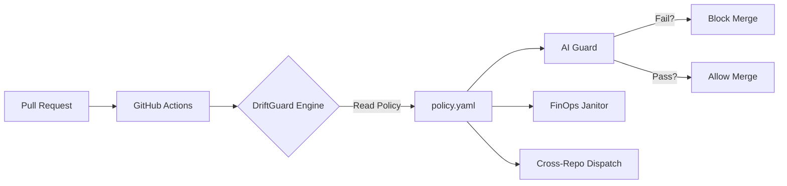

# DriftGuard 🛡️

### **Autonomous Platform Engineering Suite for Config-Driven Governance**

**Status:** 🟢 Active | **Version:** 1.0.0

DriftGuard acts as a "Governance-as-Code" layer, automating the critical checks that prevent "Broken Factory" syndrome in Platform Engineering. Instead of manual reviews, it uses a central policy engine to enforce Documentation, Cost, and Integration safety.

---

## ⚡ Key Features (The 3 Pillars)

| Module | Name | Function | Tech Stack |
| :--- | :--- | :--- | :--- |
| **Module 1** | **The Synchronizer** | **AI Documentation Guard**. Uses Google Gemini to semantic-check Pull Requests. Features **Tenacity Retries** for robustness and **Manual Override** (/driftguard override) for flexibility. | Python, Google GenAI SDK, Github Actions |
| **Module 2** | **The Janitor** | **FinOps Cost Guard**. Detects and deletes expired cloud resources. Features **Safety Checks**, **Protected Tag Logic**, **Idempotency** (handles 404s), and **JSON Logging**. | Python, Boto3, Azure SDK, Google Cloud SDK |
| **Module 3** | **The Guard** | **Cross-Repo Safety**. Automatically triggers integration tests in downstream consumer repositories. Features **Pydantic Validation** ensuring safe configuration processing. | Github API (Repository Dispatch), YAML |

---

## 🏗️ Architecture

DriftGuard uses a **State Machine** strategy. A central `policy.yaml` dictates which guards are active for every Pull Request.



---

## 🚀 Quickstart & Setup

### 1. Prerequisites
*   **GitHub Repository**: Hosted on GitHub.
*   **AWS Account**: For FinOps demonstrations.
*   **Google Gemini API Key**: For AI Analysis (Free tier works).

### 2. Configure Secrets
Navigate to **Settings > Secrets and variables > Actions** and add:
*   `GEMINI_API_KEY`: Your Google Gemini API Key.
*   `AWS_ROLE_ARN`: **Attributes of OIDC Role**. The ARN of the IAM Role you created for GitHub Actions OIDC (Trust Relationship).
*   *(Deleted)* `AWS_ACCESS_KEY_ID` / `AWS_SECRET_ACCESS_KEY`: No longer required (Zero Trust).
*   `AZURE_SUBSCRIPTION_ID`: (Optional) For Azure Resources.
*   `AZURE_CLIENT_ID`, `AZURE_TENANT_ID`, `AZURE_CLIENT_SECRET`: Azure Service Principal credentials.
*   `GCP_CREDENTIALS_JSON`: (Optional) Google Cloud Service Account Key (JSON).
*   `DRIFTGUARD_PAT`: (Recommended) A Personal Access Token with `repo` scope for Cross-Repo dispatching.
*   `DATABASE_URL`: (Optional) Example variable for testing the AI Guard.

### 3. Usage
The platform runs automatically on every Pull Request.

**Configuration:**
Edit `policy.yaml` to enable/disable specific guards:
```yaml
stages:
  - name: ai_doc_check
    enabled: true
    severity: block

# GLOBAL SAFETY SETTINGS
allow_delete:
  dry_run: true # Set to false to enable actual deletion
```

### 4. Zero-Trust Security & User Trust 🔐
DriftGuard has eliminated long-lived API keys in favor of **OIDC (OpenID Connect)** and temporary tokens.

#### Why This Matters (The "Trust-First" Model)
*   **Delegated Access:** We never see or store your root passwords. Authentication happens directly on the Cloud Provider's secure portal (AWS, Azure, Google).
*   **Token Expiry:** Access tokens are ephemeral and expire automatically after **1 hour**. Even if the database were compromised, the credentials would be useless.
*   **Least Privilege:** DriftGuard requests only the specific scopes it needs (e.g., `ec2:DescribeInstances`, `cloud-platform.read-only`), adhering to the principle of least privilege.
*   **Privacy:** The application uses the **Authorization Code Flow**, ensuring the backend only receives an authorization code, never the user's password.

#### Connection Flow
1.  **User Clicks "Connect":** Redirects to AWS/Azure/GCP.
2.  **Provider Prompts:** User approves access for specific scopes.
3.  **Callback:** Provider returns a temporary code to DriftGuard.
4.  **Token Exchange:** DriftGuard exchanges code for a short-lived access token.
5.  **Secure Session:** Token is stored in a secure, encrypted server-side session.

### 5. Observability 📊
All logs are output in structured **JSON** format (`event`, `level`, `timestamp`) for easy integration with Datadog/Splunk.
**Artifacts:** The full JSON log files (`driftguard_engine.json.log` and `driftguard_janitor.json.log`) are automatically uploaded as Build Artifacts in GitHub Actions for every run.

### 6. Safety CLI 🛡️
You can force a global simulation mode (no deletions) by using the CLI flag:
```bash
python src/engine.py --event pull_request --action opened --dry-run
```
This overrides any setting in `policy.yaml`.

---

## 🎥 How to Demonstrate (The Demo Script)

See [DEMO.md](DEMO.md) for a step-by-step presentation script.

### 1. Trip the AI Guard 🧠
1.  Add a new environment variable requirement in `src/engine.py`.
2.  Open a PR **without** updating the README.
3.  **Result:** PR assumes "Drift" and blocks the merge.

### 2. Run the Janitor 🧹
1.  Go to **Actions > FinOps Janitor Live Drill**.
2.  Run the workflow.
3.  **Result:** It provisions a live S3 bucket, detects it as "Expired", and reaps it immediately.

### 3. Verify Cross-Repo Safety 🛡️
1.  Open any PR in the core repo.
2.  Check the **Actions** tab.
3.  **Result:** A "Consumer App Integration Test" workflow is automatically triggered to verify downstream compatibility.

---

## 📂 Project Structure

```bash
driftguard/
├── .github/workflows/
│   ├── driftguard-main.yml    # (The Orchestrator) Running on every PR
│   ├── janitor-cron.yml       # (The Scheduler) Running hourly cleanup
│   └── finops-drill.yml       # (The Demo) Manual verification tool
├── src/
│   ├── engine.py              # (The Brain) Parses policy and executes modules
│   ├── guards/
│   │   ├── ai_sync.py         # Module 1: AI Logic
│   │   ├── janitor.py         # Module 2: FinOps Logic
│   │   └── cross_repo.py      # Module 3: Dispatch Logic
├── demo_app/                  # (NEW) Localhost Pitch Application
│   ├── app.py                 # FastAPI Backend Simulation
│   ├── demo_mode.py           # Mock Generator
│   ├── Dockerfile             # Containerization
│   ├── .env.example           # Credential Template
│   └── templates/index.html   # React/Tailwind Frontend
├── terraform/                 # Infrastructure Templates for AWS
├── policy.yaml                # The Source of Truth for Governance
└── requirements.txt           # Python Dependencies
```

## 🎥 The "High-Stakes" Demo App (Localhost)
For professional presentations where you cannot rely on live cloud credentials, use the built-in **Simulation App**.

### Setup & Run
1.  **Install Dependencies:** `pip install -r demo_app/requirements.txt`
2.  **Configure Keys (Optional):** Copy `demo_app/.env.example` to `demo_app/.env` and fill in your keys (Gemini, AWS, GitHub PAT).
3.  **Start Server:** `cd demo_app && python app.py`
4.  **Open Browser:** go to `http://localhost:8000`

### 🗣️ The Pitch Guide (with Toggle Mode)
*   **The Switch:** Start in **GREEN** (Simulation) mode. Say: *"This is a risk-free simulation to show you the logic."*
*   **The Flex:** Click the toggle to **RED** (Real Engine) mode. Say: *"Now, let's connect to the ACTUAL AWS Cloud and Gemini API."*
*   **The Modules:**
    *   **Dashboard:** "This is the control plane. We treat governance as a pipeline."
    *   **Module 1 (AI Context):** "The code changed here (left), but the docs didn't (right). Our AI detected this 'Drift'."
    *   **Module 2 (Janitor):** "These are real cloud costs. Watch me click 'Nuke'—the system safely destroys them."
    *   **Module 3 (Sentry):** "We test the *connection* between services, preventing backend changes from breaking the frontend."

## ⚙️ Environment Variables Reference
| Variable | Description |
| :--- | :--- |
| `DRIFTGUARD_PAT` | **Recommended**. Personal Access Token for triggering workflows in external repositories (Cross-Repo Guard). |
| `ANY_ENV_VAR` | The AI Guard now scans for *any* `os.getenv` or `os.environ` usage in your code. Check the README! |


